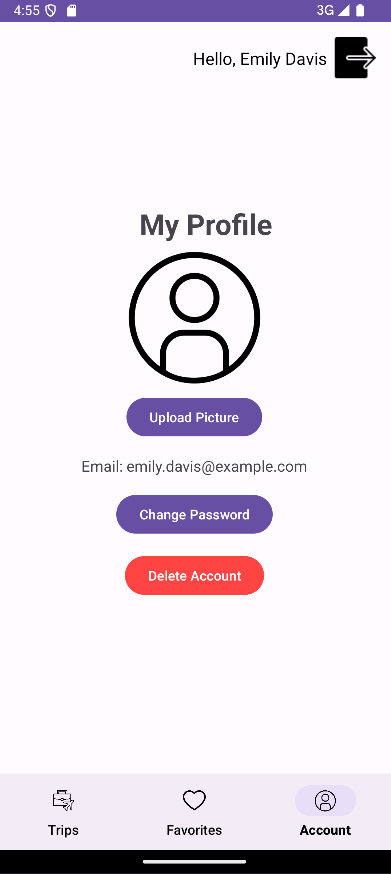

# TripPlanner App

TripPlanner is a feature-rich Android application designed for organizing and managing travel plans. Users can create trips, track flight and lodging details, discover attractions and restaurants, and keep their itineraries organized. The app uses Firebase for authentication, data storage, and image uploads, while also integrating with Google Places API for location-based features.

---

## Features

### 1. User Authentication
- **Sign Up & Sign In**: Securely create an account or log in using Firebase Authentication with email and password.
- **Profile Management**: Update profile details, including the ability to upload a profile picture. Users can also change their password or delete their account.

### 2. Trip Management
- **Create New Trip**: Users can add trips by specifying the trip name, destination city, start date, end date, and a brief description.
- **View All Trips**: All trips are displayed in a scrollable list. Each trip card shows the trip name, dates, and a favorite icon to add trips to favorites.
- **Favorites**: Trips marked as favorites appear in the Favorites section for easy access.

### 3. Detailed Itinerary Management
- **Add Flight**: Users can add flights to their trips, specifying departure and arrival times, flight number, airline, and other details. Users can also upload images, such as e-tickets.
- **Add Lodging**: Lodging details like check-in and check-out dates, address, contact details, and confirmation numbers can be added to each trip.
- **Add Restaurant**: Users can add restaurant reservations with information such as date, time, location, and contact details.
- **Add Attraction**: Users can add attractions or activities to their itinerary, including start and end times, venue information, and other relevant details.

### 4. Options Menu
- **Choose Plan Type**: A floating action button on the Trip Details page brings up an options menu where users can select to add a flight, lodging, restaurant, or attraction to the trip.

### 5. Sharing
- **Share Trip**: Trips can be shared with friends or family, allowing them to view shared itineraries.

---

## Screenshots

### Login Screen

### Signup Screen

### Profile Page

### Add Flight

### Add Lodging

### Add Trip

### Add Restaurant

### Add Attraction

### Favorites Page

### Trip Details Page

### Options Menu

### All Trips Page

---

## Usage

1. **Sign Up / Sign In**: New users can register, and existing users can log in securely with Firebase Authentication.
2. **Manage Trips**: Users can create, view, and organize multiple trips. Trips can be marked as favorites or shared with others.
3. **Detailed Itinerary**: Add flights, lodging, restaurants, and attractions to each trip to keep all travel plans organized in one place.
4. **Favorites**: Quickly access your favorite trips in the Favorites tab.
5. **Share**: Share trips with friends or family for collaborative planning.

---

## Configuration

### Firebase Setup

1. Go to the [Firebase Console](https://console.firebase.google.com/).
2. Create a new Firebase project for the app.
3. Enable Firebase services:
   - **Firebase Authentication**: Enable email/password authentication.
   - **Firestore Database**: Set up Firestore for storing trip data, favorites, and itinerary details.
   - **Firebase Storage**: Enable storage for uploading and storing profile pictures, flight tickets, and lodging confirmations.
4. Download the `google-services.json` file and place it in the `app` directory of your project.

